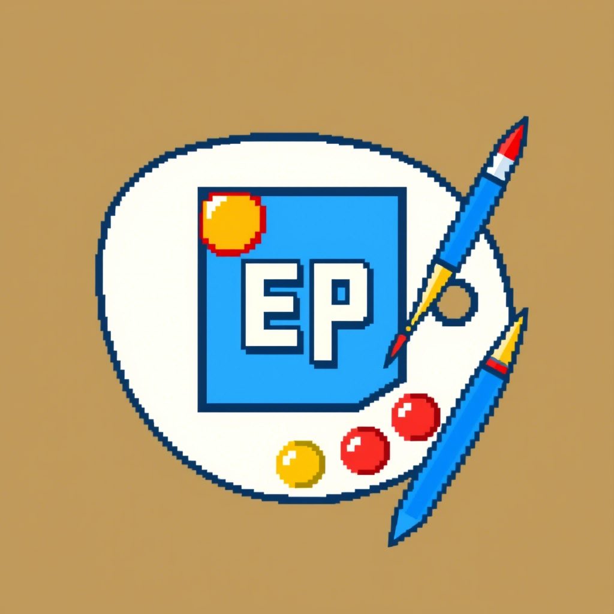

# E-Painter



## Descripción
E-Painter es un entorno de programación visual educativo desarrollado con Godot Engine y C#. Permite a los usuarios crear dibujos pixelados mediante un lenguaje de programación simple y personalizado, facilitando el aprendizaje de conceptos de programación a través de la creación artística.

## Características

- **Editor de Código Integrado**: Editor con resaltado de sintaxis para escribir programas.
- **Canvas Ajustable**: Lienzo de dibujo redimensionable de 1x1 hasta 512x512 píxeles.
- **Lenguaje de Programación Personalizado**: Lenguaje sencillo diseñado específicamente para dibujo de píxeles.
- **Retroalimentación en Tiempo Real**: Consola de salida que muestra errores y mensajes durante la ejecución.
- **Guardar y Cargar**: Funcionalidad para guardar y cargar tanto programas como imágenes resultantes.

## Requisitos del Sistema

- Godot Engine 4.4.1 o superior
- .NET 8.0 o superior

## Instalación

1. Clona este repositorio:
```
git clone https://github.com/AlexCC1206/E-Painter.git
```

2. Abre el proyecto en Godot Engine 4.4.1 o superior:
   - Inicia Godot Engine
   - Selecciona "Importar" 
   - Navega hasta la carpeta donde clonaste el repositorio
   - Abre el archivo `project.godot`

3. ¡Listo para usar!

## Uso Básico

1. **Escribir Código**: Usa el editor en la parte izquierda para escribir tu programa de dibujo.
2. **Ejecutar**: Haz clic en el botón "Run" (▶️) para ejecutar tu código y ver el resultado en el canvas.
3. **Ajustar el Tamaño del Canvas**: Cambia el valor de "Canvas Size" y haz clic en "Resize" para modificar las dimensiones del lienzo.
4. **Guardar/Cargar**: Usa los botones correspondientes para guardar o cargar tus programas.

## Guía del Lenguaje

El lenguaje de E-Painter es sencillo y está orientado al dibujo pixel por pixel. Algunos ejemplos básicos:

```
// Dibujar un punto rojo en la posición (5, 5)
dibujar(5, 5, "Red");

// Dibujar un cuadrado azul de 3x3 en la posición (10, 10)
para x = 10 hasta 12 hacer
    para y = 10 hasta 12 hacer
        dibujar(x, y, "Blue");
    fin
fin

// Dibujar una línea amarilla horizontal en la posición y=15
para x = 0 hasta 31 hacer
    dibujar(x, 15, "Yellow");
fin
```

## Estructura del Proyecto

- `Assets/`: Contiene fuentes, sprites e iconos utilizados en la interfaz
- `Scene/`: Escenas de Godot, incluyendo la escena principal de la aplicación
- `Scripts/`: Código fuente en C# organizado por módulos
  - `Core/`: Núcleo del lenguaje (lexer, parser, intérprete)
  - `UI/`: Componentes de la interfaz de usuario

## Desarrollo

Este proyecto fue desarrollado como parte del curso de programación del 2do Semestre y utiliza:

- Godot Engine como motor de juego y para la interfaz gráfica
- C# para toda la lógica de programación
- Un intérprete personalizado para el lenguaje de dibujo

## Autor

[Alexander] - [gutyalex217@gmail.com]

---

